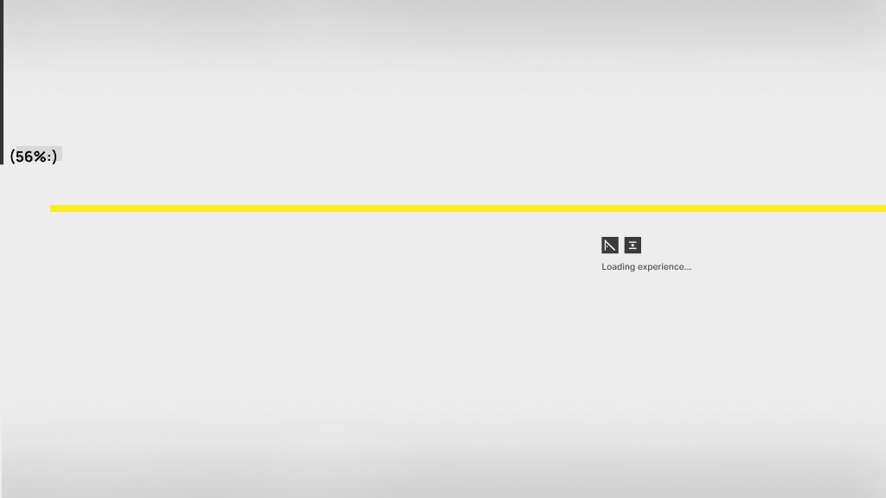

# Load screen plan

Plan for the Waypoint full-page loading experience, based on the reference mockup and phased implementation.

---

## Design reference



| Element | Spec |
|---------|------|
| Background | Soft white → light gray vertical gradient |
| **Left rail** | Thin solid black vertical bar on the **far left**; grows **downward** as progress increases |
| **Percent** | `({n}%:)` beside the bar tip — **only the number changes** (e.g. `(56%:)`) |
| **Yellow line** | Full-width horizontal rule at the same vertical position as the percent / bar tip |
| **Brand block** | Center-right: two dark gray square icons + `Loading experience…` in light gray |
| **Completion** | Sweeping fill from the **left rail** → **right**, covering the page; then **quick fade** to reveal the app |

---

## Phases

### Phase 1 — Visual scaffold (current)

**Goal:** Match the reference; tune layout and motion without real load signals.

| Task | Detail |
|------|--------|
| Create `src/luna/LoadingScreen.tsx` | Markup + progress UI + completion sweep |
| Create `src/luna/loadingScreen.css` | Full-viewport fixed layer |
| Wire `App.tsx` | Loader on top; `LunaChrome` underneath (hidden until complete) |
| Progress | **Simulated** in dev (~3s ease to 100%) |
| Completion | Sweep L→R from left edge, fade out, `onComplete` |

**Test:**

```bash
npm run dev
```

Hard refresh; confirm bar, percent format, yellow line, brand copy, sweep + reveal.

**Design preview (frozen — no fade):**

Add a query param while running `npm run dev`:

| URL | Effect |
|-----|--------|
| `?loadscreen=hold` | Freeze at **56%** (reference mockup) |
| `?loadscreen=56` | Freeze at **56%** |
| `?loadscreen=30` | Freeze at any **0–100** |
| `?loadscreen=preview` | Same as `hold` |

Example: `http://localhost:5173/?loadscreen=hold`

Remove the param for normal animated load + sweep.

---

### Phase 2 — Real ready signal

**Goal:** Progress reflects actual loading, not a timer.

| Signal | Use for progress |
|--------|------------------|
| Iframe `onLoad` | Primary — `StageEmbedFrame` → callback to `App` |
| `document.fonts.ready` | Optional bump (e.g. cap at 90% until fonts) |
| Minimum display | Optional floor (~400ms) so loader doesn’t flash |

**Files:**

- `src/luna/StageEmbedFrame.tsx` — `onEmbedLoad?: () => void`
- `src/steps/WaypointStepsScreen.tsx` — pass callback up
- `src/App.tsx` or `src/hooks/useLoadProgress.ts` — merge signals into `progress` |

**Rule:** Map iframe load to ~85–100%; simulate smooth interpolation between milestones.

---

### Phase 3 — Polish & production test

| Task | Detail |
|------|--------|
| Fade curves | Match Waypoint Manager dropdown easing `[0.22, 1, 0.36, 1]` |
| `prefers-reduced-motion` | Shorter sweep / skip motion |
| Network throttle | DevTools → Slow 3G, disable cache |
| Production | `npm run build && npm run preview` |
| Repeat visits | Optional `sessionStorage` skip (later) |

---

## File map

```
md-migration/loadscreen-plan.md     ← this doc
public/loadscreen-ref.png           ← reference image (optional copy)
src/luna/LoadingScreen.tsx          ← UI + sweep logic
src/luna/loadingScreen.css          ← styles
src/App.tsx                         ← show / hide loader
src/luna/StageEmbedFrame.tsx        ← Phase 2: onLoad
```

---

## Completion animation (spec)

1. Progress reaches **100%**; brief pause (~120ms).
2. **Sweep:** panel anchored **left center** (`transform-origin: left center`), `scaleX(0 → 1)`, ~450ms ease-out, same bg as loader.
3. **Fade:** sweep layer `opacity 1 → 0`, ~250ms; loader unmounts.
4. App (`LunaChrome`) already mounted below becomes visible.

---

## Percent format

Always render:

```txt
({Math.round(progress)}%:)
```

Examples: `(0%:)`, `(56%:)`, `(100%:)`

---

## Verification checklist

### Phase 1

- [ ] Black bar grows from top-left downward
- [ ] `(n%:)` tracks beside the bar tip
- [ ] Yellow line spans full width at progress height
- [ ] `Loading experience…` + icons match reference placement
- [ ] At 100%: sweep left → right, then fade reveals shell

### Phase 2

- [ ] Progress tied to iframe load (not timer only)
- [ ] No white flash before loader
- [ ] Throttled network still feels intentional

---

*Waypoint load screen — Phase 1 scaffold in progress.*
