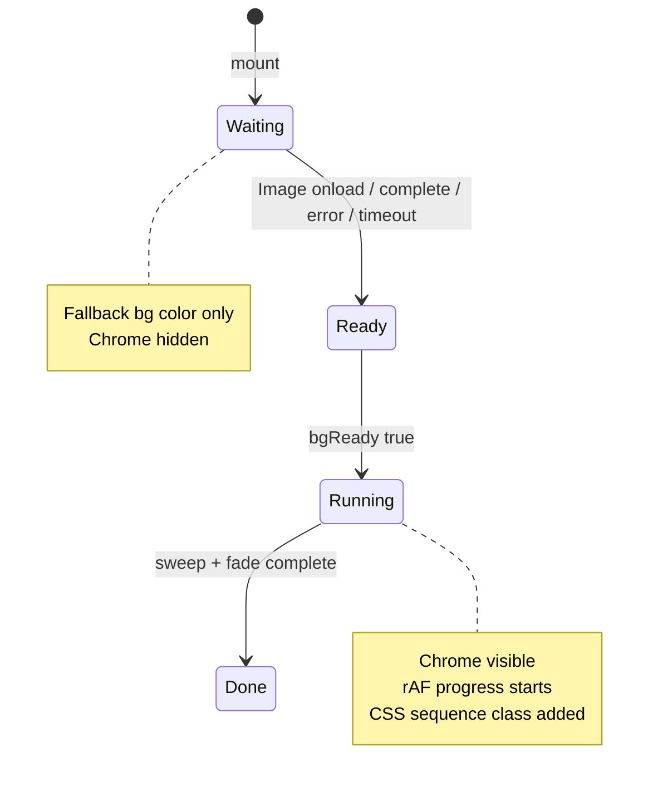

# Load Screen — Background Before Bar (Transfer Guide)

Self-contained guide for gating the loading bar (and CSS sweep/fade timeline) until the background image has loaded. Drop this pattern into any React loader that uses **CSS `animation-delay`** for exit animations.

**Parent doc:** [LOADSCREEN-PORT.md](./LOADSCREEN-PORT.md) — full load screen port.

---

## Problem

Without a gate, the progress bar starts on mount while the background is still loading. Users see:

- Gray fallback (`#ececec`) behind a moving bar and percent text
- Progress and sweep/fade **out of sync** if you only delay the rAF loop but leave CSS animations on a first-paint clock

---

## Solution (three parts)

| Part | What it does |
|------|----------------|
| **`bgReady` state** | `false` until background image loads (or timeout / error) |
| **Hide chrome until ready** | CSS hides bar/percent/brand until `loadscreen--bg-ready` |
| **Start everything together** | Progress rAF, `loadscreen--sequence`, and animation listeners all wait for `bgReady` |



---

## Constants

```ts
const LOADSCREEN_BG_URL = '/loadingscrn/ldingBG.png'
const BG_LOAD_TIMEOUT_MS = 5000
```

| Constant | Purpose |
|----------|---------|
| `LOADSCREEN_BG_URL` | Must match the URL in your CSS `background-image` (same path = browser cache hit) |
| `BG_LOAD_TIMEOUT_MS` | Never block forever — start bar after 5s even if image fails |

---

## 1. State

Initialize `bgReady` to `true` in **hold/preview** mode so design freeze skips the wait:

```tsx
const [bgReady, setBgReady] = useState(hold)
```

---

## 2. Preload effect

Preload with `new Image()`. Call `finish()` on load, error, cached `complete`, and timeout.

```tsx
useEffect(() => {
  if (hold) {
    setBgReady(true)
    return
  }

  let cancelled = false
  const img = new Image()
  const finish = () => {
    if (!cancelled) setBgReady(true)
  }

  img.onload = finish
  img.onerror = finish
  img.src = LOADSCREEN_BG_URL
  if (img.complete) finish()

  const timeout = window.setTimeout(finish, BG_LOAD_TIMEOUT_MS)

  return () => {
    cancelled = true
    window.clearTimeout(timeout)
    img.onload = null
    img.onerror = null
  }
}, [hold])
```

**Why `new Image()` instead of ``?**

- Background stays a CSS `background-image` (no markup change)
- Same URL is requested once — preload populates cache, CSS bg paints immediately when chrome reveals
- Works even if the bg div is empty

**Why `img.onerror = finish`?**

- Broken asset or 404 should not freeze the loader forever

**Why `if (img.complete) finish()`?**

- Cached images may already be decoded before `onload` fires

---

## 3. Gate progress rAF

Add `bgReady` to the dependency array and bail until true:

```tsx
useEffect(() => {
  if (hold || !bgReady) return

  const start = performance.now()
  let frame = 0

  const tick = (now: number) => {
    const t = Math.min(1, (now - start) / PROGRESS_MS)
    const eased = 1 - (1 - t) ** 2.2
    setSimProgress(clampPercent(eased * 100))
    if (t < 1) frame = requestAnimationFrame(tick)
  }

  frame = requestAnimationFrame(tick)
  return () => cancelAnimationFrame(frame)
}, [hold, bgReady])
```

---

## 4. Gate CSS sequence + lifecycle listeners

**Critical:** If your loader uses CSS `animation-delay` for sweep/fade, you must **not** add the sequence class on first paint. Add it only when `bgReady` is true.

**Also critical:** Timeout fallbacks for fade/unmount must run from **bg ready**, not from mount — otherwise they fire before the CSS animations start.

```tsx
useEffect(() => {
  if (hold || !bgReady) return

  const finish = () => {
    if (finishedRef.current) return
    finishedRef.current = true
    unlockAppBehindShutter()
    onCompleteRef.current?.()
  }

  const el = shutterRef.current

  const onAnimationStart = (event: AnimationEvent) => {
    if (event.target !== el) return
    if (event.animationName !== 'loadscreen-shutter-fade') return
    unlockAppBehindShutter()
    el?.classList.add('loadscreen--releasing')
  }

  const onAnimationEnd = (event: AnimationEvent) => {
    if (event.target !== el) return
    if (event.animationName !== 'loadscreen-shutter-fade') return
    finish()
  }

  el?.addEventListener('animationstart', onAnimationStart)
  el?.addEventListener('animationend', onAnimationEnd)

  const revealTimer = window.setTimeout(() => {
    unlockAppBehindShutter()
    el?.classList.add('loadscreen--releasing')
  }, fadeDelayMs)

  const fallback = window.setTimeout(finish, totalMs + 80)

  return () => {
    el?.removeEventListener('animationstart', onAnimationStart)
    el?.removeEventListener('animationend', onAnimationEnd)
    window.clearTimeout(revealTimer)
    window.clearTimeout(fallback)
  }
}, [hold, bgReady, fadeDelayMs, totalMs])
```

---

## 5. Class names on root

Apply both classes when background is ready; sequence only when not in hold mode:

```tsx
className={`loadscreen${
  bgReady ? ' loadscreen--bg-ready' : ''
}${!hold && bgReady ? ' loadscreen--sequence' : ''}`}
```

| Class | When | Effect |
|-------|------|--------|
| *(none extra)* | `!bgReady` | Fallback bg color; chrome hidden |
| `loadscreen--bg-ready` | image loaded | Chrome visible |
| `loadscreen--sequence` | `bgReady && !hold` | CSS sweep/fade clock starts **now** |

Do **not** use `loadscreen--sequence` from first paint if you gate on `bgReady`.

---

## 6. CSS — hide chrome until ready

Background layer stays visible (shows fallback, then image as it paints). Only **chrome** (bar, percent, brand) is hidden:

```css
.loadscreen__bg {
  position: absolute;
  inset: 0;
  z-index: 0;
  background-color: #ececec; /* visible during wait */
  background-image: url('/loadingscrn/ldingBG.png');
  background-repeat: no-repeat;
  background-position: center;
  background-size: 100% 100%;
}

.loadscreen__chrome {
  position: absolute;
  inset: 0;
  z-index: 1;
  visibility: hidden;
}

.loadscreen--bg-ready .loadscreen__chrome {
  visibility: visible;
}
```

Use **`visibility: hidden`**, not `display: none`, if you want layout to settle without a flash when revealed.

---

## Integration checklist

When porting to another project:

- [ ] Set `LOADSCREEN_BG_URL` to match CSS `background-image` path exactly
- [ ] Add `const [bgReady, setBgReady] = useState(hold)` (or `useState(false)` if no preview mode)
- [ ] Add preload `useEffect` (section 2)
- [ ] Add `!bgReady` guard + `bgReady` dep to progress effect
- [ ] Add `!bgReady` guard + `bgReady` dep to animation lifecycle effect
- [ ] Change root `className` — sequence class only when `bgReady`
- [ ] Add CSS hide/reveal for `.loadscreen__chrome`
- [ ] Confirm hold/preview mode sets `bgReady` immediately

---

## Pitfalls

| Mistake | Result |
|---------|--------|
| Delay rAF only, keep `loadscreen--sequence` on mount | Sweep runs before bar finishes |
| Lifecycle timeouts on mount, sequence on `bgReady` | Early unlock / unmount |
| Different URL in preload vs CSS | Double download, bg still flashes |
| No timeout / no `onerror` handler | Loader stuck on 0% forever |
| `display: none` on chrome | Possible layout shift when shown |

---

## Testing

### Dev — slow network

1. DevTools → **Network** → **Slow 3G**, disable cache
2. Hard refresh
3. Expect: gray fallback only → bg appears → bar starts at 0%

### Preview — production bundle

```bash
npm run build && npm run preview
```

Hard refresh on preview URL; throttled network shows the wait more clearly than dev.

### Hold mode (no animation)

`?loadscreen=hold` — should skip preload wait (`bgReady` starts true) and show frozen frame immediately for layout work.

---

## Optional: earlier preload in `index.html`

For faster bg ready before React hydrates, add to `<head>`:

```html
<link rel="preload" as="image" href="/loadingscrn/ldingBG.png" />
```

The React `new Image()` gate still required — this only starts the download earlier.

---

## Source reference (this repo)

| File | What to copy |
|------|----------------|
| `src/luna/LoadingScreen.tsx` | `LOADSCREEN_BG_URL`, `BG_LOAD_TIMEOUT_MS`, `bgReady` state, three gated effects, className |
| `src/luna/loadingScreen.css` | `.loadscreen__chrome` visibility + `.loadscreen--bg-ready` rule |

---

*Background-before-bar gate — synced with steps-waypoint LoadingScreen implementation.*
