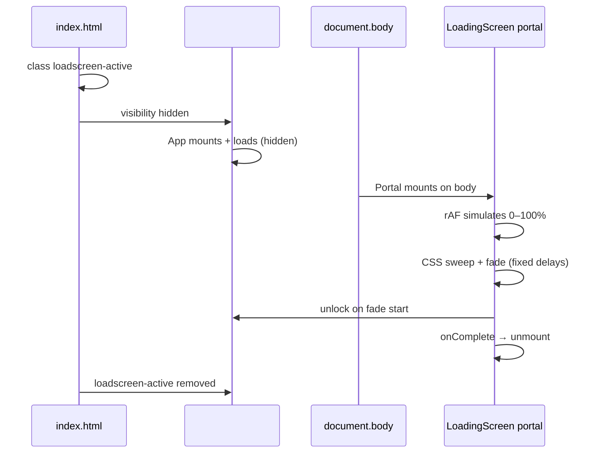

# Load Screen — Port Guide

Use this document to copy the **Waypoint full-page loading screen** into another React + Vite project with a similar Luna-style shell (document rem scaling, fixed artboard layout, app mounts underneath).

The loader is a **visual curtain only** — the real app (navbar, iframe, etc.) mounts and loads immediately underneath. The user sees a designed intro first; when the curtain fades, the app is already there.

---

## What problem this solves

| Problem | Fix |
|---------|-----|
| Hard refresh (F5) skips sweep / jumps to black | Timeline driven by **CSS `animation-delay`** from first paint, not React state |
| Loader fights with app z-index | Render via **`createPortal(..., document.body)`** outside `#root` |
| White flash before loader | **`loadscreen-active`** on `<html>` in `index.html` **before** React boots |
| App visible during loader | `#root { visibility: hidden }` while `html.loadscreen-active` |
| Reveal shows empty background | **`unlockAppBehindShutter()`** when fade **starts** so app is visible behind fading curtain |

---

## Architecture



**Layers (bottom → top):**

1. `#root` — full app shell (hidden until unlock)
2. `.loadscreen__bg` — background image
3. `.loadscreen__chrome` — progress rail, percent stack, brand block
4. `.loadscreen__sweep` — dark panel `scaleX(0→1)` left → right
5. `.loadscreen` root — final opacity fade, then unmount

---

## Files to copy

| Action | Path in this repo | Purpose |
|--------|-------------------|---------|
| **Create** | `src/luna/LoadingScreen.tsx` | UI, progress rAF, portal, lifecycle |
| **Create** | `src/luna/loadingScreen.css` | Layout + CSS-timed sweep/fade |
| **Create** | `src/luna/loadscreenShutter.ts` | `lock` / `unlock` html class |
| **Create** | `src/luna/loadscreenPreview.ts` | `?loadscreen=hold` dev preview |
| **Edit** | `index.html` | Early `loadscreen-active` class |
| **Edit** | `src/index.css` | Hide `#root` while active |
| **Edit** | `src/App.tsx` | Show loader, reload / bfcache handling |
| **Edit** | `src/main.tsx` | **No `StrictMode`** (see pitfalls) |
| **Assets** | `public/loadingscrn/*` | Background, icons, tracker, tagline PNG |

**npm dependency (percent font):**

```bash
npm install @fontsource/manrope
```

Import in `LoadingScreen.tsx`:

```ts
import '@fontsource/manrope/700.css'
```

---

## 1. `index.html` — shutter before React

Set the class on `<html>` and duplicate in an inline script so it survives even if the attribute is stripped:

```html
<!doctype html>
<html lang="en" class="loadscreen-active">
  <head>
    ...
    <script>
      document.documentElement.classList.add('loadscreen-active')
    </script>
  </head>
  <body>
    <div id="root"></div>
    <script type="module" src="/src/main.tsx"></script>
  </body>
</html>
```

---

## 2. `src/index.css` — hide app under curtain

```css
html.loadscreen-active #root {
  visibility: hidden;
}
```

Use **`visibility: hidden`**, not `display: none` — the app still mounts, lays out, and loads iframes/fonts while invisible.

---

## 3. `loadscreenShutter.ts`

```ts
export const LOADSCREEN_HTML_CLASS = 'loadscreen-active'

export function lockAppBehindShutter() {
  document.documentElement.classList.add(LOADSCREEN_HTML_CLASS)
}

export function unlockAppBehindShutter() {
  document.documentElement.classList.remove(LOADSCREEN_HTML_CLASS)
}
```

---

## 4. `loadscreenPreview.ts` — design freeze URL

| URL param | Effect |
|-----------|--------|
| `?loadscreen=hold` | Freeze at **56%**, no sweep/fade |
| `?loadscreen=preview` | Same as `hold` |
| `?loadscreen=pause` | Same as `hold` |
| `?loadscreen=56` | Freeze at any **0–100** |

Example: `http://localhost:5173/?loadscreen=hold`

In hold mode the shutter **unlocks** the app immediately so you can interact with the page behind the frozen frame.

---

## 5. `App.tsx` — wiring

Pattern:

```tsx
import { LoadingScreen } from './luna/LoadingScreen'
import { getLoadscreenPreview } from './luna/loadscreenPreview'
import { useCallback, useEffect, useMemo, useState } from 'react'

function App() {
  const [loadscreenDone, setLoadscreenDone] = useState(false)
  const [loadKey, setLoadKey] = useState(() => Date.now())
  const loadscreenPreview = useMemo(() => getLoadscreenPreview(), [])
  const showLoadscreen = loadscreenPreview.hold || !loadscreenDone
  const handleLoadscreenComplete = useCallback(() => setLoadscreenDone(true), [])

  // Re-run loader on hard refresh
  useEffect(() => {
    const nav = performance.getEntriesByType('navigation')[0] as
      | PerformanceNavigationTiming
      | undefined
    if (nav?.type === 'reload') {
      setLoadscreenDone(false)
      setLoadKey(Date.now())
    }
  }, [])

  // Re-run loader when restored from bfcache
  useEffect(() => {
    const onPageShow = (event: PageTransitionEvent) => {
      if (!event.persisted) return
      setLoadscreenDone(false)
      setLoadKey(Date.now())
    }
    window.addEventListener('pageshow', onPageShow)
    return () => window.removeEventListener('pageshow', onPageShow)
  }, [])

  return (
    <>
      <div className="app-shell">
        {/* Your shell — mounts immediately */}
        <YourChrome>
          <YourMainContent />
        </YourChrome>
      </div>
      {showLoadscreen ? (
        <LoadingScreen
          key={loadKey}
          hold={loadscreenPreview.hold}
          progress={
            loadscreenPreview.hold ? loadscreenPreview.progress : undefined
          }
          onComplete={handleLoadscreenComplete}
        />
      ) : null}
    </>
  )
}
```

**Important:** Render `LoadingScreen` as a **sibling** of the app shell, not inside it. The component portals to `document.body` but still needs to mount from a top-level place that isn’t hidden by `#root` visibility… actually the portal escapes `#root` — the sibling placement keeps React tree clear and matches this repo.

`key={loadKey}` forces a fresh loader instance on reload/bfcache.

---

## 6. `main.tsx` — no StrictMode

```tsx
createRoot(document.getElementById('root')!).render(<App />)
```

Do **not** wrap in `<StrictMode>`. Double mount in dev can desync CSS animation listeners and shutter unlock timing.

---

## Timeline (constants in `LoadingScreen.tsx`)

| Phase | Constant | Default |
|-------|----------|---------|
| Background preload | `BG_LOAD_TIMEOUT_MS` | 5000ms max wait (starts on error too) |
| Progress ease | `PROGRESS_MS` | 3000ms |
| Pause at 100% | `PAUSE_MS` | 120ms |
| Sweep duration | viewport-scaled | 400–650ms (`innerWidth × 0.35`, clamped) |
| Dark hold after sweep | `HOLD_MS` | 250ms |
| Curtain fade | `FADE_MS` | 400ms |

**Computed delays (injected as CSS vars on `.loadscreen`):**

```
progressEndMs  = PROGRESS_MS + PAUSE_MS          → 3120ms
fadeDelayMs    = progressEndMs + sweepMs + HOLD_MS
totalMs        = fadeDelayMs + FADE_MS
```

**CSS pipeline** (classes `loadscreen--bg-ready` then `loadscreen--sequence` — both applied when `/loadingscrn/ldingBG.png` has loaded):

See **[LOADSCREEN-BG-BEFORE-BAR.md](./LOADSCREEN-BG-BEFORE-BAR.md)** for the full bg-before-bar transfer guide.

| Time | What happens |
|------|----------------|
| Before bg ready | Fallback `#ececec` only; chrome hidden |
| `0 → progressEnd` (after bg ready) | rAF updates bar height + percent; chrome visible |
| `progressEnd` | Chrome hidden (`loadscreen-hide-chrome` 0s delayed) |
| `progressEnd → +sweepMs` | `.loadscreen__sweep` `scaleX(0→1)` |
| `progressEnd + sweepMs` | Background hidden |
| `fadeDelayMs` | Root `.loadscreen` opacity `1→0`; **app unlocked** on `animationstart` |
| Fade end | `onComplete()` → unmount |

Easing: sweep uses `cubic-bezier(0.22, 1, 0.36, 1)` (matches Waypoint dropdown feel).

---

## Design spec (current Waypoint artboard)

Assume **1rem = 16px** at design root. If your project uses `applyLunaDocumentScale` (html `font-size` scaled to viewport), size UI elements in **rem** so they scale with the shell.

### Colors

| Token | Value |
|-------|-------|
| Bar | `#333333` |
| Percent | `#000000` |
| Yellow line | `#f5e642` |
| Status text | `#333333` |
| Sweep / bar | `#333333` |
| BG fallback | `#ececec` |

### Left progress rail

| Element | Spec |
|---------|------|
| Bar track | `1rem` (16px) wide, full height, left edge |
| Bar fill | Grows **downward** with `height: {progress}%` |
| Marker | `top: {progress}%`, `transform: translateY(-100%)` — yellow line bottom aligns with bar bottom |

### Percent stack (beside marker)

Vertical flex column, `gap: 1.25rem` (20px), `margin-left: 1.5rem`:

| Item | Spec |
|------|------|
| Tracker | `tracker-rect.svg`, `0.6875rem × 1.875rem` (11×30), `margin-left: 0.625rem` |
| Percent | `[{n}%:]` — Manrope 700, `3.25rem` (52px), `letter-spacing: -0.03em` |
| Tagline PNG | `smollwrd.png`, `10.98rem × 2.16rem` (176×35 display — 96% of 183×36 artboard), `margin-left: 0.625rem` |
| Yellow line | Full viewport width, `0.375rem` (6px) tall, `margin-top: 1.375rem` (22px below stack) |

**Percent format:** `[{Math.round(progress)}%:]` — square brackets, not parentheses.

### Brand block (`.loadscreen__brand`)

| Property | Value |
|----------|-------|
| Position | `left: 1304px; top: 604px` (fixed artboard coords — adjust per design) |
| Icons | `website-icon.svg` + `waypoint-icon.svg`, 36×36, `gap: 13px` |
| Label | `// Loading Waypoint...`, Inter 400, `1.3125rem` (21px) |
| Icons → text gap | `1.0625rem` (17px) |

### Background

`ldingBG.png` — `background-size: 100% 100%`, centered, no repeat.

### Assets (`public/loadingscrn/`)

```
ldingBG.png
tracker-rect.svg
smollwrd.png
website-icon.svg
waypoint-icon.svg
```

Update paths in `loadingScreen.css` and `LoadingScreen.tsx` if you use a different folder.

---

## `LoadingScreen.tsx` — logic summary

### Props

```ts
type LoadingScreenProps = {
  hold?: boolean           // preview mode — no animation
  progress?: number        // fixed % when hold (default 56)
  onComplete?: () => void  // called when fade ends (or immediately in hold? no — hold never calls)
}
```

### React responsibilities

- **`useLayoutEffect`**: `lockAppBehindShutter()` on mount (unless `hold`)
- **`useEffect` (preload)**: `new Image()` for `ldingBG.png`; sets `bgReady`; 5s timeout fallback
- **`useEffect` (rAF)**: simulate `0 → 100%` over `PROGRESS_MS` — **only after `bgReady`**
- **`useEffect` (animation)**: listen for `loadscreen-shutter-fade` start/end — only after `bgReady`; unlock on start; `onComplete` on end; timeout fallbacks
- **`createPortal`**: render to `document.body`
- **CSS classes**: `loadscreen--bg-ready` reveals chrome; `loadscreen--sequence` starts sweep/fade clock
- **CSS vars**: pass `--loadscreen-progress-end`, `--loadscreen-sweep-ms`, `--loadscreen-fade-ms`, `--loadscreen-fade-delay`

### Portal markup structure

```
.loadscreen[.loadscreen--bg-ready][.loadscreen--sequence]
  .loadscreen__bg
  .loadscreen__chrome
    .loadscreen__progress
      .loadscreen__bar-track > .loadscreen__bar
      .loadscreen__marker
        .loadscreen__percent-stack
          img.loadscreen__tracker
          p.loadscreen__percent
          img.loadscreen__smollwrd
        .loadscreen__hline
    .loadscreen__brand
      .loadscreen__icons > img × 2
      p.loadscreen__status
  .loadscreen__sweep          (omitted in hold mode)
```

`z-index: 2147483646` on `.loadscreen` keeps it above typical app UI.

---

## `loadingScreen.css` — key rules

### Sequence animations

```css
.loadscreen--sequence .loadscreen__chrome {
  animation: loadscreen-hide-chrome 0s var(--loadscreen-progress-end) forwards;
}

.loadscreen--sequence .loadscreen__bg {
  animation: loadscreen-hide-chrome 0s
    calc(var(--loadscreen-progress-end) + var(--loadscreen-sweep-ms)) forwards;
}

.loadscreen--sequence .loadscreen__sweep {
  animation: loadscreen-sweep var(--loadscreen-sweep-ms) var(--loadscreen-progress-end)
    cubic-bezier(0.22, 1, 0.36, 1) forwards;
}

.loadscreen--sequence {
  animation: loadscreen-shutter-fade var(--loadscreen-fade-ms) var(--loadscreen-fade-delay)
    ease-out forwards;
}
```

### Reduced motion

```css
@media (prefers-reduced-motion: reduce) {
  .loadscreen--sequence .loadscreen__sweep { animation-duration: 200ms; }
  .loadscreen--sequence { animation-duration: 200ms; }
}
```

---

## Pitfalls

| Don’t | Do instead |
|-------|------------|
| Gate app mount on loader `onComplete` | Mount app immediately; loader is overlay only |
| Drive sweep/fade from `useState` + `setTimeout` | CSS `animation-delay` from first paint |
| Put loader inside `#root` without portal | `createPortal(..., document.body)` |
| Use `display: none` on `#root` | `visibility: hidden` so layout/load still runs |
| Size PNGs by intrinsic pixels only | Use **rem** widths so they match rem-scaled text when document scale is active |
| Wrap app in `StrictMode` | Single mount for shutter timing |
| Wait for iframe `onLoad` to show loader (Phase 1) | Optional Phase 2 — see below |

### Image sizing note

Raster assets should use explicit **rem** dimensions in CSS (like `.loadscreen__tracker` and `.loadscreen__smollwrd`). If you only rely on intrinsic PNG pixels, they stay fixed while rem-scaled text shrinks on smaller viewports and look disproportionately large.

---

## Phase 2 (optional) — real load progress

Current implementation uses a **simulated** 3s ease. To tie progress to real signals:

| Signal | Suggested weight |
|--------|------------------|
| Iframe `onLoad` | Jump to ~85–100% |
| `document.fonts.ready` | Cap or bump mid-progress |
| Minimum display time | ~400ms floor so loader doesn’t flash |

Keep the **same CSS sweep/fade timeline** — only replace the rAF progress source. Do not wait for load before **mounting** the app.

---

## Customization checklist

When porting to a new project, search/replace:

- [ ] `// Loading Waypoint...` → your status copy
- [ ] `aria-label="Loading Waypoint"` on shutter root
- [ ] Brand block `left` / `top` for your artboard size
- [ ] Asset paths under `public/loadingscrn/`
- [ ] Background image file
- [ ] `PROGRESS_MS` and sweep constants if timing should differ
- [ ] Percent format if design differs from `[{n}%:]`

---

## Verification checklist

### Normal load

- [ ] Hard refresh (F5): no skip — full progress → sweep → fade
- [ ] No white flash before loader appears
- [ ] App is interactive immediately after fade (already loaded underneath)
- [ ] Bar grows top → bottom; marker tracks bar bottom
- [ ] `[n%:]` updates smoothly 0 → 100

### Preview

- [ ] `?loadscreen=hold` freezes at 56%, no sweep
- [ ] `?loadscreen=30` freezes at 30%
- [ ] App behind loader is usable in hold mode

### Edge cases

- [ ] bfcache back-navigation replays loader (`pageshow` + `persisted`)
- [ ] `prefers-reduced-motion`: shorter animations
- [ ] Resize: sweep duration scales with viewport width

### Production

```bash
npm run build && npm run preview
```

Repeat hard refresh on preview URL; test Slow 3G in DevTools if iframe-heavy.

---

## Source file reference (this repo)

```
index.html
src/index.css
src/main.tsx
src/App.tsx
src/luna/LoadingScreen.tsx
src/luna/loadingScreen.css
src/luna/loadscreenShutter.ts
src/luna/loadscreenPreview.ts
public/loadingscrn/
```

Copy those files verbatim as a starting point, then customize copy, coords, and assets.

---

*Waypoint load screen — visual shutter pattern. Last synced with steps-waypoint implementation (CSS-timed sweep, portal, hold preview, rem-sized tagline at 96% artboard).*
